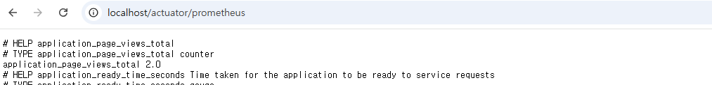
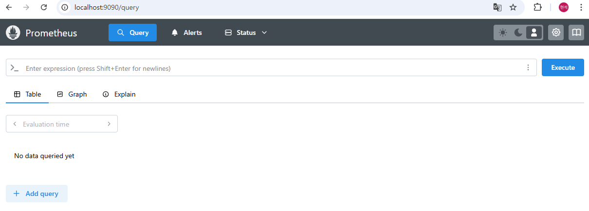
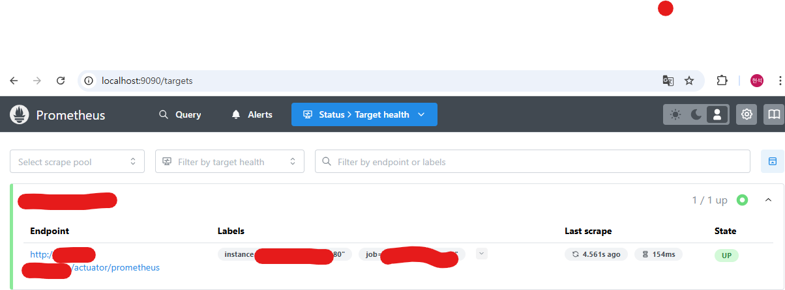
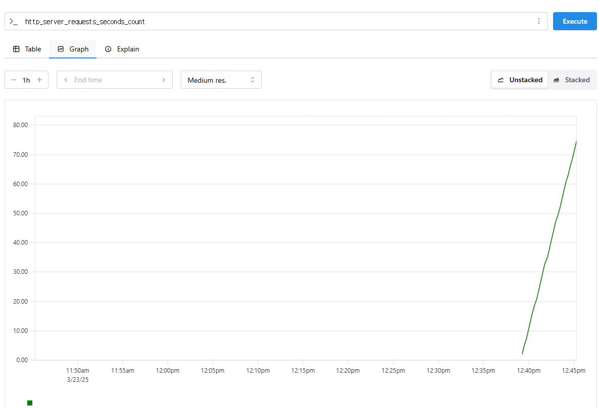
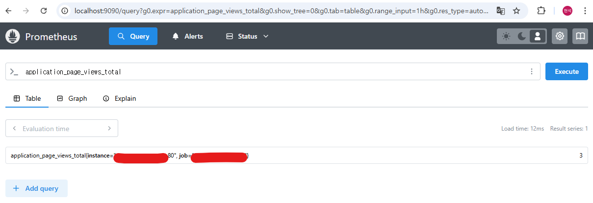

## Prometheus + Grafana 도입의 필요성

최근 업무에서 프로젝트의 수집 중인 로그 "품질"이 높아질 필요가 있었다.  

현재는 logback 을 사용해 단순히 .log 파일로 기록하던 방식에서

추가적인 요청사항이 들어왔고 추후 로그 관리의 확장성을 고려해야 했다.

결국 해당 로그들을 DB에 기록해야 할 필요가 있어 Prometheus + Grafana 를 적용해 로그와 메트릭 수집을 진행하였다.

해당 모니터링 시스템을 구축하기 까지의 과정을 적어보려 한다.

<hr>

## ⚓️ SpringBoot Actuator

먼저 기본적으로 프로메테우스에서 실행중인 어플리케이션의 모니터링을 바라볼 Actuator를 추가해주자.

```gradle
//SpringBoot Actuator
implementation 'org.springframework.boot:spring-boot-starter-actuator'

//Prometheus
runtimeOnly 'io.micrometer:micrometer-registry-prometheus'
```

gradle 에서 해당 설정을 추가해주고

각 application.yml 과 prometheus.yml 에서 프로메테우스의 설정을 추가해주자
```properties
//application.yml
management:
  endpoints:
    web:
      exposure:
        include: "*"
  endpoint:
    prometheus:
      enabled: true
      
//prometheus.yml
global:
  scrape_interval: 5s

scrape_configs:
  - job_name: 'app'
    metrics_path: '/actuator/prometheus'
    scrape_interval: 5s
    static_configs:
      - targets: ['app:80']
```

prometheus.yml 의 targets 은 추후 docker compose로 올릴 컨테이너의 이름으로 잡아주었다.

이렇게 설정을 잡고 localhost:[설정한 원격포트]/actuator/prometheus 를 들어가 보면 해당 화면처럼 나오게 된다.


(민감한 사항으로 인해 아래 부분은 비노출, actuator의 경우 외부에 노출되면 안될 민감한 정보가 있다.)

<hr>

## 📄 Docker Compose 설정

각 앱의 경우 각각 하나하나 설치해서 올려도 무관하지만

Docker 혹은 Docker-Compose 를 사용해서 관리하는걸 추천한다.

```docker
version: '3.8'
services:
  app:
    image: app:latest
    container_name: app
    ports:
      - "80:80"
    environment:
      - SPRING_PROFILES_ACTIVE=${PROFILE:-dev}
      - TZ=Asia/Seoul
    volumes:
      - /logs:/logs
      - /logs/error:/logs/error
    networks:
      - monitoring-network

  prometheus:
    image: prom/prometheus
    container_name: prometheus
    volumes:
      - [path]/prometheus.yml:/etc/prometheus/prometheus.yml -- prometheus.yml 경로
    command:
      - '--config.file=/etc/prometheus/prometheus.yml'
    ports:
      - "9090:9090"
    networks:
      - monitoring-network

  grafana:
    image: grafana/grafana
    container_name: grafana
    ports:
      - "3000:3000"
    networks:
      - monitoring-network

networks:
  monitoring-network:
    driver: bridge
```

중요한 부분은

1. app 의 경우 SpringBoot 이미지로 prometheus.yml 에서 targets 의 이름을 참고해 설정
2. networks 를 하나로 묶어 추후 프로메테우스에서 모니터링 하게 되는 내부 네트워크를 설정해주자

자 인제 docker compose 를 올려주고 확인해보자

```angular2html
docker compose up -d
```

localhost:9090/query 프로메테우스의 포트로 접속해보면


해당 화면이 나오면 프로메테우스 컨테이너는 제대로 올라가있다.

가장 중요한 localhost:9090/targets 을 들어가 확인해보자



이 state이 "UP"으로 나와야지 프로메테우스에서 SpringBoot의 actuator/prometheus 경로를 제대로 읽은 것이다.

만약 "DOWN"으로 되어있다면 docker-compose.yml 내의 컨테이너 이름 설정 혹은 Prometheus.yml 의 targets에서 경로를 제대로 설정해 주어야 한다.

만약 "UP" 설정이 제대로 되어있다면 /query에서 모니터링에서 간단하게 query를 테스트 해보자


(현재 어플리케이션에서 요청의 모든 count를 나타내는 메트릭)

<hr>

## 😎 Custom Metrics 수집

현재 간단하게 pv, uv 값을 수집하는 메트릭을 추가하려고 한다.

[pv, uv 란?](https://www.beusable.net/blog/?p=3781)

코드에서는 아주 간단하게 pv, uv 를 수집하는 메트릭을 추가해주었고

메트릭의 이름은 "application_page_views_total", "application_unique_visitors_total" 로 해주었다.

어플리케이션을 접속해 보고 프로메테우스에서 확인해보자




<hr>

## 🔒 보안적인 부분

Actuator나 Prometheus에서 수집되는 메트릭은 절대 외부에 노출되면 안된다.

[Actuator 보안 이슈](https://www.springcloud.io/post/2022-02/spring-boot-actuator-security-issues/#gsc.tab=0)

Actuator는 사용중인 서비스의 경로, DB의 정보뿐 아니라 잘못 하면 개인적인 정보까지 노출될 가능성이 있어 보안적인 부분을 항상 생각해야 된다.

Grafana의 경우 자체적인 보안 설정을 진행할 수 있어서 제외하고

Actuator와 Prometheus 에서는 어떻게 보안을 구현했는지 적어본다.

<br>

### SpringBoot Actuator

먼저 나의 경우 기본적으로 Actuator를 Security 설정으로 추가해두었다.

만약 Security 설정을 authenticated로 막아둔다면 권한인증된 회원만 접속 가능해 문제가 없다.

하지만 여기서 중요한 점은 Prometheus도 메트릭 수집을 위해 Actuator의 경로를 바라봐야한다는 것이다.

적절하게 설정을 해주지 않으면 Prometheus의 targets에서 /actuator/prometheus 경로에 접근할 수 없어 state 가 "DOWN"으로 된다.

```java
//Prometheus.yml
global:
  scrape_interval: 5s

scrape_configs:
  - job_name: 'app'
    metrics_path: '/actuator/prometheus'
    scrape_interval: 5s
    authorization:
      type: Bearer
      credentials: '프로메테우스 헤더 secret key'
    static_configs:
      # 원격 설정은 변경 필요
      - targets: ['app:80']

//Security Filter
@Slf4j
public class ActuatorFilter extends OncePerRequestFilter {

	private static final String PROMETHEUS_KEY = "프로메테우스 헤더 secret key";

	@Override
	protected void doFilterInternal(HttpServletRequest request, HttpServletResponse response,
		FilterChain filterChain) throws ServletException, IOException {

		String requestURI = request.getRequestURI();

		if (requestURI.startsWith("/actuator")) {
			String authHeader = request.getHeader("Authorization");

			if (authHeader != null && authHeader.equals("Bearer " + PROMETHEUS_KEY)) {
				filterChain.doFilter(request, response);
				return;
			}

			Authentication authentication = SecurityContextHolder.getContext().getAuthentication();
			if (authentication != null && authentication.isAuthenticated()) {
				log.info("JWT authentication successful for actuator");
				filterChain.doFilter(request, response);
				return;
			}

			// 인증 실패 시 401 Unauthorized 응답
			log.info("Actuator Filter Failed");
			SecurityContextHolder.clearContext();
			response.setStatus(HttpServletResponse.SC_UNAUTHORIZED);
			response.sendRedirect("/login");
			return;
		}

		filterChain.doFilter(request, response);
	}
}
```
프로메테우스의 설정에서 header에 authorization을 설정해주자.

이렇게 Filter에 /actuator 를 접근하는 요청에 authorization 을 확인하고 인증된 요청이 아닐 경우

에러 페이지(해당 코드에선 /login)으로 리다이렉트를 시켜주어 인가를 설정해주었다.

그럼 Spring Security에서

```java
http
			...
			
			.addFilterBefore(jwtAuthenticationFilter, UsernamePasswordAuthenticationFilter.class)
			.addFilterBefore(new JwtAuthorizationFilter(authenticationManager, memberRepository),
				BasicAuthenticationFilter.class)
			//actuator 필터를 jwt 권한 인증 이후로 설정
			.addFilterAfter(actuatorFilter, JwtAuthorizationFilter.class)
			...
			
				//actuator 이후 경로를 모두 허용으로 진행 후 필터에서 검증을 거치게 하자
				.requestMatchers("/actuator/**").permitAll()
```

해당 설정을 잡아주면

/actuator/** 의 경로는 권한인증된 회원 + 프로메테우스 요청만 허용되게 해주었다.

<br>

### Prometheus

프로메테우스의 설정은 아무래도 원격서버에서 진행되는 만큼 원격서버의 스펙에 따라 달라질 수 있다.

일단 기본적으로 BasicAuthentication을 적용했고 블로그의 글들이나 ChatGPT 에서 정보를 얻을 수 있다.

[공식문서의 Basic Auth 방법](https://prometheus.io/docs/guides/basic-auth/)

<hr>

## So..

이번 글에서는 SpringBoot 애플리케이션에 Prometheus와 Grafana를 적용하여 메트릭을 수집하고 모니터링하는 방법을 적어보았다.

(Grafana의 경우는 Prometheus를 설정하였다면 무난하게 설정할 수 있고 블로그의 글들도 넘쳐나서 따로 기재하지 않았다.)

- SpringBoot Actuator 설정 방법
- Prometheus 연동 및 Docker Compose를 통한 환경 구성
- Actuator와 Prometheus의 보안 구성 방법

이러한 모니터링 시스템을 구축함으로써 애플리케이션의 상태와 성능을 실시간으로 파악할 수 있게 되었고, 

로그 품질을 단순히 .log 파일로 분석하는 것보다 높은 퀄리티로 바꾸게 되었다.

조금 아쉬운 점이 있다면 Prometheus는 메트릭 수집에 중점을 두고 있어 APM 같은 Query 로깅, Transaction 관리에는 조금 부족한 부분이 보인다는 것이다.

이 점은 다음에 Prometheus의 서드파티 혹은 다른 APM을 통해서 구현할 수 있는 방법을 찾아보려 한다.
