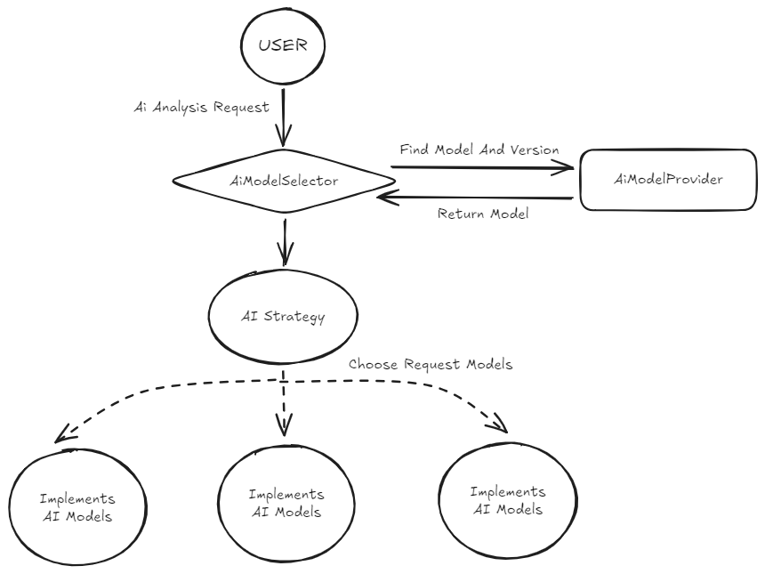

## Spring AI

해당 내용은 전부 공식 문서를 참조해서 구현하였습니다.

설명이 부족하거나 동작이 궁금한 부분은 [공식문서](https://spring.io/projects/spring-ai#overview)를 참조하기 바랍니다.

<br>

## 왜 Spring AI인가?

회사 내에서 LLM을 활용하여 사용자에게 분석 자료를 제공하는 기획을 받았다.

이에 따라 각 AI 제공사의 API를 사용하여 기능을 구현해야 했다.

### 기존 문제점

다른 블로그 글에서 찾아볼 수 있듯이 하나의 AI모델 API를 구현하는 것은 어렵지 않다.

구글에 검색을 하거나 직접 AI API페이지를 찾아보면 충분히 구현 가능하다.  
하지만 넓게 봐서 여러 AI를 사용해야 된다면 어떨까.

이런 생각에서 Spring AI는 AI 모델들의 구현 방식을 상위 단계에서 추상화된 구현체가 컨트롤 해줌으로써 우리가 원하는 AI, 그 안의 세부 모델까지 지정해서 동작시킬 수 있게 도와주는 프레임워크이다.

<br>

## 설정

### build.gradle

```groovy
dependencyManagement {
    imports {
        mavenBom "org.springframework.ai:spring-ai-bom:1.1.0-M3" //google gen ai 지원
    }
}

dependencies {
    ...
    //openai
    implementation 'org.springframework.ai:spring-ai-starter-model-openai'
    //gemini
    implementation 'org.springframework.ai:spring-ai-starter-model-google-genai'
    ...
}
```
위 코드에서 dependencyManagement를 통해 spring-ai-bom을 선언한 것을 볼 수 있다.

Spring AI는 여러 하위 모듈(OpenAI, Gemini 등)로 구성되어 있고, 이때 각 라이브러리의 버전을 개별적으로 지정하면 버전 간 호환성 충돌이 발생할 위험이 있습니다.

BOM을 사용하면 호환성이 검증된 버전 셋을 기준으로 의존성을 관리해 준다. 

덕분에 dependencies 블록에서 각 스타터 모듈을 추가할 때 버전을 일일이 명시하지 않아도 되며, 안정적인 버전 관리가 가능해진다.

BOM을 설정한 이후에는 각 모델의 의존성을 찾아서 추가해준다.

<br>

### application.yml

```yml
spring:
  ...
  ai:
    chat:
      client:
        enabled: false # 멀티 모델 핵심 설정
    # OpenAI API
    openai:
      api-key: ##api key 입력
      chat:
        completions-path: /v1/chat/completions
        options:
          model: gpt-5
          # gpt-5, gpt-5-mini -> temperature 필수 고정값
          temperature: 1
    # Gemini API
    google:
      genai:
        api-key: ##api key 입력
        chat:
          options:
            model: gemini-2.5-pro
```

[Multiple Chat Models](https://docs.spring.io/spring-ai/reference/api/chatclient.html#_working_with_multiple_chat_models) 해당 부분의 설명을 보면 후에 구현할 여러 모델의 Bean 설정을 위해서 해당 부분을 false 로 설정한다.

이후 openai, gemini 기본 설정을 해준다.  
참고로 model의 경우는 기본 설정을 application.yml에 설정을 했다 하더라도 추후 Bean 설정을 통해서 모델을 바꿀 수 있다.(그게 Spring AI의 핵심이라고 생각한다)


#### gpt-5와 gpt-5-mini를 사용하려한다면 temperature 설정은 필수
[관련 Github 이슈](https://github.com/spring-projects/spring-ai/issues/4097)

<br>

### config 설정
```java
@Configuration
public class AiConfig {

	/**
	 * OpenAI Config
	 * @param chatModel openai chat model
	 * @return
	 */
	@Bean
	public ChatClient openAiChatClient(OpenAiChatModel chatModel) {
		return ChatClient.create(chatModel);
	}

	/**
	 * Gemini Config
	 * @param chatModel gemini chat model
	 * @return
	 */
	@Bean
	public ChatClient geminiAiChatClient(GoogleGenAiChatModel chatModel) {
		return ChatClient.create(chatModel);
	}
}
```

다른 모델들을 사용하기 위해선 관련된 ChatModel을 주입한 ChatClient Bean을 만들면 된다.

openAi, gemini 말고 가능한 AI모델의 경우 이 문서를 [참조](https://docs.spring.io/spring-ai/reference/api/chat/comparison.html) 해보자.

<br>

### ChatClient?

[ChatClient](https://docs.spring.io/spring-ai/reference/api/chatclient.html) 빈설정에서 보이는 이 객체는 공식 문서를 통해 알 수 있듯이 스프링 애플리케이션과 AI모델을 연결하는 객체로써 아주 중요한 역할을 하고 있다.

코드에서 보다시피 각 AI모델의 ChatModel을 주입해주었다면 해당 세팅은 마무리된 것이며 이제 원하는 AI를 호출하기 위해선 적절한 구분값으로 해당 Bean을 호출하면 된다.

<br>

### Code

코드의 주요 흐름은 이렇다.



1. 사용자의 분석요청이 들어온다.
2. 파라미터로 함께 들어온 AI 구분값으로 응답해줄 AI모델을 찾은 후
3. 각각 구현된 AI Model 구현체에서 ChatClient를 통해서 API 호출을 한다.

(Controller, Service 코드는 복잡한 흐름이 없으니 생략)

#### AiModelSelector, AiModelProvider
```java
@Service
@RequiredArgsConstructor
public class AiModelSelector {

    private static final String VENDOR_OPEN_AI = "OPEN_AI";
    private static final String VENDOR_GEMINI = "GEMINI";
    private final AiService openAiService;
    private final AiService geminiAiService;

    /**
     * ai Bean 선택 메서드
     *
     * @param model
     * @return
     */
    public AiService selectAiService(String model) {

        AiModelProvider aiModel = AiModelProvider.fromValue(model);

        String aiVendor = getVendorFromModel(aiModel.getModel());

        return switch (aiVendor) {
            case VENDOR_OPEN_AI -> openAiService;
            case VENDOR_GEMINI -> geminiAiService;
            default -> throw new AiModelNotFoundEx("Unknown vendor: " + aiVendor);
        };
    }

    /**
     * AI 관련 호출될 Bean 선택 메서드
     *
     * @param model
     * @return
     */
    private String getVendorFromModel(String model) {
        if (model.contains("gpt")) {
            return VENDOR_OPEN_AI;
        } else if (model.contains("gemini")) {
            return VENDOR_GEMINI;
        } else {
            throw new AiModelNotFoundEx("Vendor mapping not implemented for model: " + model);
        }
    }
}
```
```java
@Getter
@RequiredArgsConstructor
public enum AiModelProvider {

    GPT_5("gpt-5"),
    GPT_5_MINI("gpt-5-mini"),
    GPT_4o("gpt-4o"),

    GEMINI_2_5_PRO("gemini-2.5-pro"),
    GEMINI_2_5_FLASH("gemini-2.5-flash");

    private final String model; //실제 모델이름과 동일일

    public static AiModelProvider fromValue(String value) {
        return Arrays.stream(AiModelProvider.values())
            .filter(ai -> ai.model.equals(value))
            .findFirst()
            .orElseThrow(() -> new AiModelNotFoundEx("Unknown ai provider value : " + value));
    }
}

```

여러개의 AI 그리고 더 세분화된 모델별 버전을 사용하기 위해서는 <code>AiModelProvider</code>의 model은 임의로 작성하는 것이 아닌 실제 모델명을 적어 추후 ChatClient 의 options 값에 넣어야한다.

#### AiService, AiImplements 구현체
```java
public interface AiService {

    /**
     * 공통 응답 API
     *
     * @param systemPrompt
     * @param userPrompt
     * @param model
     * @return
     */
    String callAiChat(String systemPrompt, String userPrompt, String model);
}
```

```java
@Service("geminiAiService")
public class GeminiAiServiceImpl implements AiService {

	private final ChatClient geminiChatClient;

	public GeminiAiServiceImpl(@Qualifier("geminiAiChatClient") ChatClient geminiChatClient) {
		this.geminiChatClient = geminiChatClient;
	}

    @Override
    public String callAiChat(String systemPrompt, String userPrompt, String model) {

        GoogleGenAiChatOptions modelOption = GoogleGenAiChatOptions.builder()
            .model(model)
            .build();

        return geminiChatClient.prompt()
            .options(modelOption)
            .system(systemPrompt)
            .user(userPrompt)
            .call()
            .content();
    }
}
```
```java
@Service("openAiService")
public class OpenAiServiceImpl implements AiService {

	private final ChatClient openAiChatClient;

	public OpenAiServiceImpl(@Qualifier("openAiChatClient") ChatClient openAiChatClient) {
		this.openAiChatClient = openAiChatClient;
	}

    @Override
    public String callAiChat(String systemPrompt, String userPrompt, String model) {

        OpenAiChatOptions modelOption = OpenAiChatOptions.builder()
            .model(model)
            .build();

        return openAiChatClient.prompt()
            .options(modelOption)
            .system(systemPrompt)
            .user(userPrompt)
            .call()
            .content();
    }
}
```

AiService를 전략패턴처럼 구현하여 각 AI별로 응답을 할 수 있게 만들었다.

만약 다른 모델을 추가해야된다면 새로운 ModelServiceImpl을 추가하고 callAiChat 메서드만 구현하면 된다.

<br>

## 마무리
이로써 Spring AI를 활용해 두 가지 LLM 모델 더나아가 추가되는 모델에도 유연하게 연동하는 과정을 코드로 구현하였다.

단순히 코드의 구성을 설명한 것이기 때문에 구체적인 API는 [공식문서](https://docs.spring.io/spring-ai/reference/)를 참조하시길 추천한다.