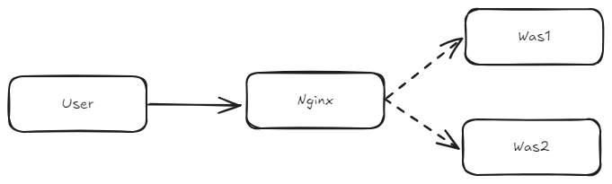

## Session Clustering

사이드 프로젝트를 진행하던 도중, 화면 구현을 thymeleaf + vanilla.js로 구현하다 보니 꽤나 귀찮은 부분이 많았다.

먼저 사이드프로젝트의 흐름을 살펴보자면 간단하게

```
사용자 -> 이미지 업로드 -> 이미지 편집 -> AI 합성 -> 결과 반영 
```

이 정도의 흐름이다.

여기서 문제가 되는 부분은 최초에 이미지를 업로드하게 되면 해당 이미지를 다른 path 경로로 넘겨주는 로직이 존재하는데 이 과정이 로컬에서와 달리 원격서버에서 문제가 되는 부분이 있었다.

현재 원격서버의 경우 Nginx를 Reverse Proxy로 이중화 서버를 구성해놓은 상태이다.



#### 이미지 업로드시 문제가 되었던 서버 코드

```java
@PostMapping("/image")
public String uploadImage(@RequestParam("image") MultipartFile file,
                          RedirectAttributes redirectAttributes,
                          HttpSession session) {

  if (file.isEmpty()) {
    redirectAttributes.addFlashAttribute("message", "업로드할 파일을 선택해주세요.");
    return "redirect:/image";
  }

  String mimeType = file.getContentType();
  if (mimeType == null || !mimeType.startsWith("image")) {
    redirectAttributes.addFlashAttribute("error", "이미지 파일만 업로드할 수 있습니다.");
    return "redirect:/image";
  }

  try {
    session.setAttribute("uploadedImage", file.getBytes());
    session.setAttribute("uploadedImageContentType", mimeType);

    return "redirect:/image";
  } catch (IOException e) {
    e.printStackTrace();
    redirectAttributes.addFlashAttribute("error", "파일 처리에 실패했습니다.");
    return "redirect:/image";
  }
}
```

이 redirect로 인해서 클라이언트는 다시 `/image` 경로로 GET 요청을 보내게 된다.

이때 **Nginx의 로드밸런싱(Round Robin)** 정책에 의해 문제가 발생한다.

1. **사용자**가 **Was1**에 `POST /image` 요청 (이미지 업로드)
2. **Was1**은 자신의 **In-Memory(HttpSession)** 에 이미지 데이터를 저장하고 `JSESSIONID`를 발급
3. **Was1**은 클라이언트에게 `redirect:/image` 응답
4. 클라이언트는 다시 `GET /image` 요청을 보냄
5. **Nginx**가 이번 요청을 **Was2**로 전달
6. **Was2**의 메모리에는 해당 `JSESSIONID`에 대한 세션 정보가 없음
7. 결과적으로 **세션 불일치(Session Inconsistency)** 가 발생하여 업로드한 이미지가 보이지 않거나 에러 발생

즉, **Scale-out** 된 환경에서 별도의 세션 관리를 하지 않으면, 각 서버가 독립적인 세션 저장소를 갖기 때문에 데이터 정합성이 깨지게 된다. 

이를 해결하기 위해 **Sticky Session**이나 **Session Clustering** 같은 전략이 필요하다. 

<br>

### Nginx 설정

```nginx
...

upstream backend_servers {
        server was1:8080;
        server was2:8080;
}
  
```

현재 이 설정으로 진행될 경우 라운드로빈 형태로 Was1, Was2 서버를 순차적으로 접근하게 된다.

이 문제로 인해 최초의 해결방법은 **Sticky Session**을 사용하는 것이었다.

```nginx
...
upstream backend_servers {
        ip_hash;  #추가
        server was1:8080;
        server was2:8080;
}
...
```

하지만 Sticky Session은 올바른 해결책이 될 수는 없었다.

서버의 이중화의 목적은 여러 요청에 대한 처리를 분산하여서 사용자에게 쾌적한 응답속도를 제공하는 것이었다.

하지만 Sticky Session은 세션이 살아있는 동안 동일한 서버를 사용하는 것이기 때문에 부하의 균형을 이루지 못한다.

이런 부분을 해결하기 위해서 Session Clustering을 사용해보았다.

### Session Clustering

Session Clustering은 여러 서버가 공유할 수 있는 세션 저장소를 사용하여 세션을 공유하는 방법이다.

이러한 방법으로는 **Redis**를 사용하는 것이 가장 일반적이고 구성하는 방법도 어렵지 않았다.

```groovy
    //redis
    implementation 'org.springframework.boot:spring-boot-starter-data-redis'
    implementation 'org.springframework.session:spring-session-data-redis'
```

- application-prod.yml
```yml
spring:
  session:
    redis:
      namespace: spring:session
    timeout: 30m
  data:
    redis:
      host: redis
      port: 6379
```

이 설정으로 인해서 spring session이 redis를 사용하여 세션을 관리하게 된다.

하지만 해당 설정으로 인해서 일반 local 서버를 사용할 경우 redis를 필수적으로 동작시켜야 한다는 단점이 있다.

- application-dev.yml
```yml
spring:
  autoconfigure:
    exclude:
      - org.springframework.boot.autoconfigure.data.redis.RedisAutoConfiguration
      - org.springframework.boot.autoconfigure.session.SessionAutoConfiguration
```

이 설정은 강제로 redis를 설정에서 제외시켜주게 된다.
이로 인해서 만약 default 프로필로 사용하고 있었다면 dev 프로필 혹은 로컬 프로필로 실행되게 변경하고 진행해준다면 redis를 로컬 환경에서 같이 동작시키지 않고 진행할 수 있게 된다.

그렇다면 원격서버에서는 제대로 spring session 이 설정되었는지 확인해보자.

```sh
docker exec -it redis redis-cli

# 이미지 업로드 세션 사용 전
127.0.0.1:6379> keys *
(empty array)

# 이미지 업로드 세션 사용 이후
127.0.0.1:6379> keys *
1) "spring:session:sessions:481bf991-5a99-4cab-80c2-c0bb72797c21"

```

---

## 마무리

이렇게 **Redis**를 활용한 **Session Clustering**을 도입함으로써, 여러 대의 서버가 운영되는 환경에서도 **세션 불일치 문제**를 깔끔하게 해결할 수 있었다.

물론 Redis라는 별도의 인프라를 구축하고 관리해야 한다는 비용이 발생하지만, **Scale-out**이 자유로운 아키텍처를 가져가면서도 사용자에게 **일관된 경험**을 제공하기 위해서는 필수적인 선택이었다고 생각한다.
